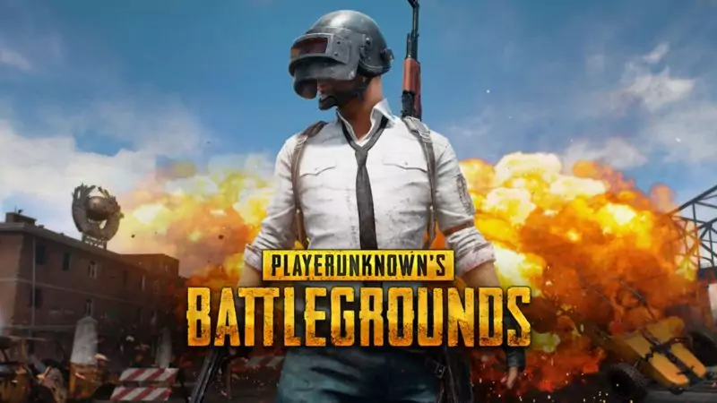

<!DOCTYPE html>
<html>
<head>
<title>Page Title</title>
</head>
<body>

<h1>Tudengikood/matriklinumber: 213475IACB </h1>
<h2>Ees- ja perekonnanimi: Andrei Shvedov </h2>

<h3>10 parimat võrgumängu </h3>

 1. PUBG/PLAYERUNKNOWN'S BATTLEGROUNDS.

 2. Apex Legends.

 3. Fortnite Battle Royale.

 4. Counter Strike: Global Offensive.

 5. League Of Legends.

 6. Minecraft.

 7. Hearthstone.

 8. DOTA 2.

 9. Final Fantasy 14.

 10. Division 2.

 Mängud on enamasti lõbu pärast. Näiteks minge pärast rasket päeva sisse ja lõdvestuge. Kuid mõne jaoks on mängudest juba saanud rahateenimise viis.  
Näiteks suurim turniir on DOTA 2, mille auhinnafond on üle 40 miljoni dollari. See arendab võrgumänge ja meelitab neid mänge mängima uusi kasutajaid.  
Sellepärast 1 koht on PUBG. Inimestele meeldib võistelda, samuti üritatakse kellestki mööda pääseda. Just see idee viis selle mängu esikohale.

<a href="https://www.youtube.com/watch?v=ahw5KBuHtKY&ab_channel=dota2"> YouTube: Dota 2 turnire TI10 avamine </a>   <a href=https://firstsportz.com/top-10-most-popular-online-games-in-2021/>   Link: Top 10 teavet võrgumängude kohta </a>
  

 
<a href= https://taltech.ee/>  https://taltech.ee/</a>
</body>
</html>
